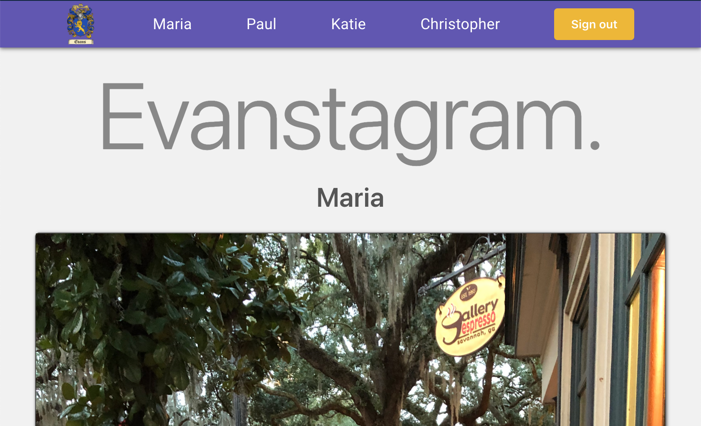
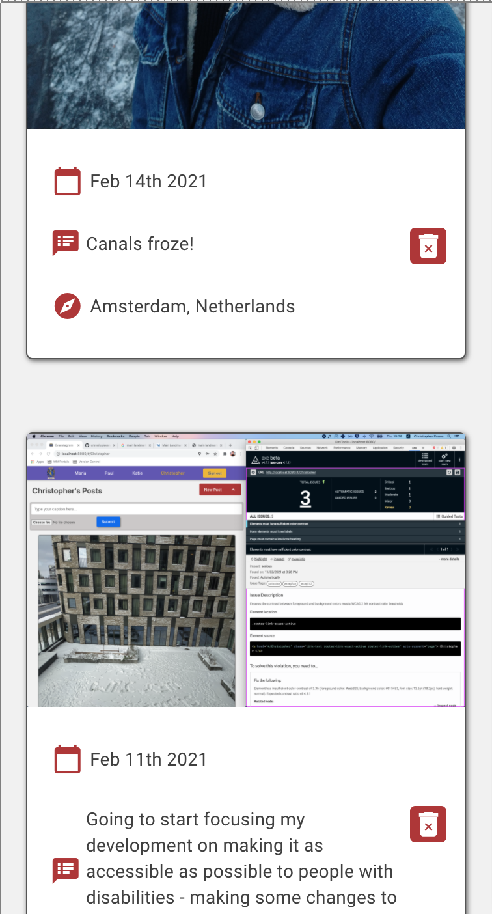
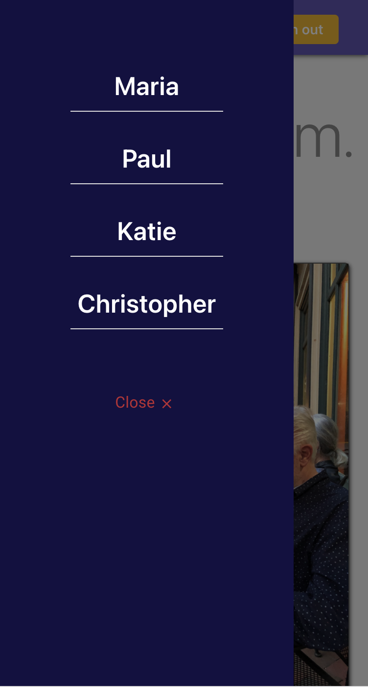

# Evanstagram

An Evans-family-excusive photo-sharing social network.

My family and I often send pictures to one another via WhatsApp groups and the like, so I wanted somewhere we could upload and store our highlights for posterity. I created Evanstagram (get it? We're the _Evans_ family and it's a site like _Instagram_. 🦗) to serve as a digitised, ever-lasting photo album. Plus, as we are spread out across two continents, I wanted to add another method to connect to one another -- particularly during the pandemic that has kept us apart for over a year.

### Features

* Upload and share photos or videos with captions.
* Automatic timestamping, as well as geo-tagging via Google API.
* Mobile-first feat. mobile-only side-panel menu, but also desktop-ready.
* Auth, image storage, and photo data via Firebase.

### Made Using

     

  

# ToDo List
- [x] Retry vue-material
- [x] Get GeoPoint data
- [x] Error handling & validation for upload form
- [x] Upload form -> dropdown
- [x] Auth
- [ ] Error handling (general)
- [ ] Hide API key
- [ ] Find out why can't pass name param for refreshImages fn
- [x] UX feedback for submitting a new post
- [x] Up/down icon for new post
- [x] Mobile design; https://regenrek.com/posts/how-to-create-an-animated-vue-sidebar-menu-with-vue-observable/
- [x] Replace font for title
- [x] Change v-ifs to v-shows when not rendering to DOM but merely displaying (more performant)
- [x] ~~Change template logic to computed props (more performant)~~
- [ ] Delete window showing for all posts
- [ ] Location on safari
- [ ] Rendering a new on page switching
